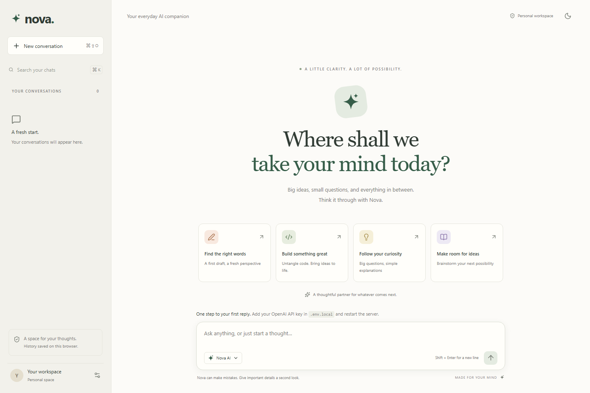

# Nova AI

A thoughtful AI chatbot built with **TypeScript, Next.js, React, and Tailwind CSS**. Nova combines a ChatGPT-style conversation layout with a warm cream-and-sage visual identity, real OpenAI streaming, and a private personal workspace.



[View the mobile interface](docs/nova-mobile.png).

## Start locally

Requires Node.js 22 or newer (Node.js 24 recommended), npm, and an OpenAI API key with available API billing.

```bash
npm ci
```

Copy `.env.example` to `.env.local`:

```powershell
# Windows PowerShell
Copy-Item .env.example .env.local
```

```bash
# macOS / Linux
cp .env.example .env.local
```

Set your server-side configuration:

```dotenv
OPENAI_API_KEY=your-api-key
OPENAI_MODEL=gpt-5-mini
APP_PASSWORD=your-long-unique-workspace-password
```

```bash
npm run dev
```

Open [localhost:3000](http://localhost:3000). Enter the workspace password if configured. For local development only, `APP_PASSWORD` can be left empty. Without an API key, the interface works and explains setup; it does not simulate AI replies. Restart the server after changing environment variables.

Never commit `.env.local`, paste API keys into the chat, or expose keys with a `NEXT_PUBLIC_` prefix. A ChatGPT subscription does not configure this application's API access.

## What it does

- Streams real AI responses as they arrive, with conversation context.
- Renders Markdown, tables, lists, and fenced code with copy controls. Untrusted raw HTML and external model-generated images are not rendered.
- Supports stop, retry, and regenerate; interrupted answers are excluded from follow-up context.
- Saves up to 80 conversations in this browser, with search, rename, confirmed deletion, and Markdown export.
- Includes responsive mobile navigation, light/dark themes, starter prompts, keyboard shortcuts, and reduced-motion support.
- Keeps API credentials on the server and protects production access with a password and signed, expiring HTTP-only session cookies.
- Handles provider errors, missing configuration, timeouts, unavailable storage, and rate limits.

Use Enter to send and Shift + Enter for a newline. Use Ctrl/Cmd + K to search chats and Ctrl/Cmd + Shift + O for a new conversation. Escape closes dialogs and mobile navigation.

## AI integration

Nova uses the official OpenAI JavaScript SDK and [Responses API streaming](https://developers.openai.com/api/docs/guides/streaming-responses). The server forwards text deltas as newline-delimited JSON and requires a completion event before marking a reply complete. Responses use `store: false` and a bounded output budget. Browser history is sent as a rolling context window of recent complete turns, limited to 30 messages and 40,000 characters; older turns can fall outside the model's context. Individual user messages are limited to 8,000 characters.

The default [GPT-5 mini](https://developers.openai.com/api/docs/models/gpt-5-mini) model can be changed through `OPENAI_MODEL` to any text model available to your account that supports the Responses API. Model availability and billing depend on your OpenAI account. Nova is a text assistant; it has no web search, file upload, image generation, or tool execution.

History is local to this browser and is not synced between devices. Messages still go to OpenAI for inference; `store: false` does not override OpenAI's own data retention policies. Export important chats before clearing browser data. This application does not provide multiple user accounts.

## Project structure

```text
src/app/                 Next.js pages, layout, and Tailwind styles
src/app/api/chat/        Validated, authenticated AI streaming endpoint
src/app/api/session/     Workspace sign-in, sign-out, and configuration status
src/components/          Chat interface, safe Markdown, and native modal dialogs
src/lib/chat.ts          Request schema, context window, and stream parser
src/lib/storage.ts       Validated browser history
src/lib/server/          Authentication, HTTP boundaries, and rate limiting
tests/unit/              Conversation, stream, auth, HTTP, and route tests
tests/e2e/               Desktop and mobile browser workflows
.github/workflows/ci.yml Automated checks, build, and browser tests
```

Dependencies are pinned and `package-lock.json` is committed for reproducible installs.

## Validate

```bash
npm run check             # ESLint, TypeScript, Vitest
npm run format:check      # Prettier
npm run build             # Production build
node scripts/smoke-production.mjs # Verify the production password gate
npx playwright install chromium
npm run test:e2e          # Desktop and mobile Chromium tests
npm audit
```

Tests mock the provider boundary and do not require a real key or make paid API calls. Verify actual OpenAI connectivity manually with a configured key by sending a message and a follow-up, and stopping a streamed response. A configured key indicator means a key is present; it does not verify its validity or available quota.

## Deploy

Deploy as a Next.js application on a Node.js host or a platform that supports Next.js server routes and streaming. GitHub hosts the source; **GitHub Pages cannot run this server**.

```bash
npm ci
npm run build
npm start
```

Configure `OPENAI_API_KEY`, `OPENAI_MODEL`, and a strong `APP_PASSWORD` in your hosting provider's secret settings. Production intentionally refuses AI requests without password authentication. Serve production over HTTPS so secure session cookies work. Configure your proxy to preserve the original `Host` header, disable response buffering, and allow streaming requests lasting up to 120 seconds. Session cookies expire after 24 hours; changing `APP_PASSWORD` invalidates existing sessions.

The built-in chat limit (20 requests per minute) and login limit (10 attempts per minute) are global, process-local budgets suited to a personal workspace. For multiple replicas or public access, add a shared rate limiter and platform-level traffic controls. OpenAI usage is charged to the configured key; set an appropriate project budget in your OpenAI account.

## Git workflow

Implementation steps use plain-language commits such as `Update files for secure AI streaming` and `Update files in readme`. The GitHub Actions workflow validates pushes to `main` and pull requests, including browser tests without API credentials.
